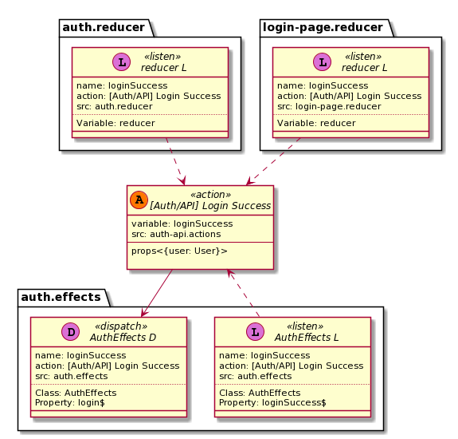
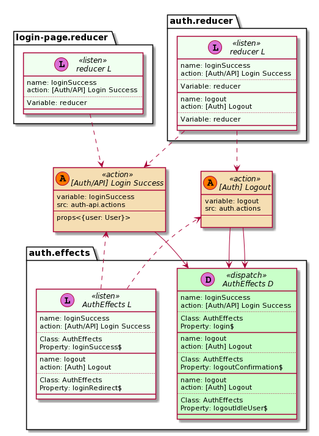

# ngrx-uml
Generate Plant UML diagram from [ngrx/store](https://ngrx.io) project (version >= 7.0).

Generate separete diagram for each [Action](https://ngrx.io/guide/store/actions) or/and [Reducer/State](https://ngrx.io/guide/store/reducers).

Searches for:
- actions created function [createAction](https://ngrx.io/api/store/createAction) and their use
- reducers created function  [createReducer](https://ngrx.io/api/store/createReducer)

## Installation

#### Node Package [npm](https://www.npmjs.com/package/ngrx-uml)

To download and install the ngrx-um run the following command:

```bash
npm install -g ngrx-uml
```

## Commands
Invoke the tool on the command line through the `ngrx-uml` executable. 

The command `ngrx-uml --help` lists the available commands.
`ngrx-uml <command> --help` shows available options for the <command> (such as diagram).

```bash
ng --help
ng diagram --help
```

| Command      | Description                                                                                                                                     |
| ------------ | ----------------------------------------------------------------------------------------------------------------------------------------------- |
| **diagram**    | Generate plantUML diagram                                                                        |
| **diagnostic** | Diagnostic tools                                                                        |


### Diagram Command

#### Usage:

```bash
ngrx-uml diagram -f '**/*.ts' -d ../ngrx/projects/example-app/ -i '../**/*.spec.ts' -c tsconfig.app.json
```
Important: ***Glob-like file patterns must be in quotation marks***

| Option | Alias | Description                         | Type | Default |
| --------| ------| ------------------------------------------------------------------- | -------- | ---------- |
|  --version    | |              Show version number                                    | boolean |            |
| --log     | -l |   Log level. [choices: "TRACE", "DEBUG", "INFO", "WARN", "ERROR", "SILENT"] | | "INFO" |
|  --help   | -h |          Show help                                                    |    boolean | |
|  --files | -f  |           Glob-like file pattern specifying the filepath for the source files. Relative to baseDir.  **IMPORTANT!!** Use with quote " or ' | string  |  "**/*.ts" |
|  --ignore | -i  |          Glob-like file pattern specifying files to ignore. **IMPORTANT!!** Use with quote " or ' | array | ["\*\*/*.spec.ts", "\*\*/node_modules/\*\*"] |
|  --imageFormat | --im |    Image format. To turn off image generation set to off [choices: "eps", "latex", "png", "svg", "txt", "off"] | | "png" |
|  --outDir | -o   |         Redirect output structure to the directory      |  string | "out"  |
|  --baseDir | -d  |         Path to project base directory                   |   string | "" |
|  --tsConfig | -c |         tsconfig.json file name with relative path from baseDir | string |  "tsconfig.json" |
|  --toJson | --js |         Generate intermediate files to json             | boolean  |  false |
|  --wsd    | |               Generate plant uml file (.wsd)                | boolean  | false |
|  --clickableLinks | --cl | Convert  terminal links to clickable in vs code terminal | boolean | false |


## Examples

Generated from source code [ngrx/store example app](https://github.com/ngrx/platform/tree/master/projects/example-app) 

### Action diagram (png)



### Auth Reducer diagram (png)



### Action diagram (wsd) 

```pascal
@startuml [Auth/API] Login Success

set namespaceSeparator ::
skinparam class {
    BackgroundColor<<listen>> HoneyDew
    BackgroundColor<<action>> Wheat
    BackgroundColor<<dispatch>> Technology
}

interface "[Auth/API] Login Success" << (A,#FF7700) action >> {
    variable: loginSuccess
    src: auth-api.actions
    --
    props<{user: User}>
}


interface "auth.reducer:: reducer L" << (L,orchid) listen >> {
    name: loginSuccess
    action: [Auth/API] Login Success
    ..
    Variable: reducer
    __
}

"[Auth/API] Login Success" <.down. "auth.reducer:: reducer L"

interface "login-page.reducer:: reducer L" << (L,orchid) listen >> {
    name: loginSuccess
    action: [Auth/API] Login Success
    ..
    Variable: reducer
    __
}

"[Auth/API] Login Success" <.down. "login-page.reducer:: reducer L"

interface "auth.effects:: AuthEffects D" << (D,orchid) dispatch >> {
    name: loginSuccess
    action: [Auth/API] Login Success
    ..
    Class: AuthEffects
    Property: login$
    __
}

"[Auth/API] Login Success" -down-> "auth.effects:: AuthEffects D"

interface "auth.effects:: AuthEffects L" << (L,orchid) listen >> {
    name: loginSuccess
    action: [Auth/API] Login Success
    ..
    Class: AuthEffects
    Property: loginSuccess$
    __
}

"[Auth/API] Login Success" <.down. "auth.effects:: AuthEffects L"

@enduml
```

[Plantuml file](docs/assets/examples/_Auth-API_Login-Success.wsd)

### JSON 

[Actions JSON](docs/assets/examples/actions_Action.json)

[Actions with references JSON](docs/assets/examples/action-references_Action.json)

[Reducers JSON](docs/assets/examples/actions_Reducer.json)

[Reducers with references JSON](docs/assets/examples/action-references_Reducer.json)

```JSON
{
    "name": "[Auth] Logout Confirmation Dismiss",
    "kind": 1002,
    "kindText": "Action",
    "variable": "logoutConfirmationDismiss",
    "filePath": "./actions/auth.actions.ts",
    "references": [
      {
        "name": "logoutConfirmationDismiss",
        "kind": 1003,
        "kindText": "ActionReference",
        "documentation": "",
        "isCall": true,
        "filePath": "./effects/auth.effects.ts",
        "fileName": "auth.effects",
        "declarationContext": [
          {
            "kindText": "ClassDeclaration",
            "name": "AuthEffects"
          },
          {
            "kindText": "PropertyDeclaration",
            "name": "logoutConfirmation$"
          }
        ]
      }
    ]
  }
```


## Using from source code


### Installation

```bash
npm install ngrx-uml
```

### Example


#### Use GeneratorService

```typescript 
import {
    ActionConvertContextFactory, ActionReferenceConvertContextFactory,
    ActionsPlantDiagramRenderFactory, GeneratorOptions, GeneratorService, PlantUmlOutputService
} from 'ngrx-uml';

export function useGeneratorService(): void {

    const options: GeneratorOptions = {
        outDir: 'out/generator',
        imageFormat: 'png',
        ignorePattern: ['**/*.spec.ts'],
        saveActionsReferencesToJson: false,
        saveActionsToJson: false,
        saveWsd: false,
        logLevel: 'INFO'
    };

    const plantUmlService = new PlantUmlOutputService({
        outDir: options.outDir || 'out',
        ext: options.imageFormat || 'png',
        clickableLinks: options.clickableLinks || true,
        saveWsd: options.saveWsd || false
    });


    const generateService = new GeneratorService(
        plantUmlService,
        [
            new ActionConvertContextFactory,
            new ActionReferenceConvertContextFactory,
        ],
        new ActionsPlantDiagramRenderFactory().create(),
        [plantUmlService],
        options
    );

    const files = '../../test/test_data/**/*.ts';
    generateService.generate(files);

}

```

#### Use CreateActionsDiagramService

```typescript 
import { CreateActionsDiagramService, GeneratorOptions } from 'ngrx-uml';

export function useCreateActionsDiagramService(): void {
    const options: GeneratorOptions = {
        outDir: 'out/create-actions-diagram-service',
        imageFormat: 'svg',
        ignorePattern: ['**/*.spec.ts'],
        saveActionsReferencesToJson: true,
        saveActionsToJson: true,
        saveWsd: true,
        logLevel: 'INFO'
    };
    const files = '../../test/test_data/**/*.ts';
    const createActionsDiagramService = new CreateActionsDiagramService(options);
    createActionsDiagramService.generateDiagram(files);
}
```
