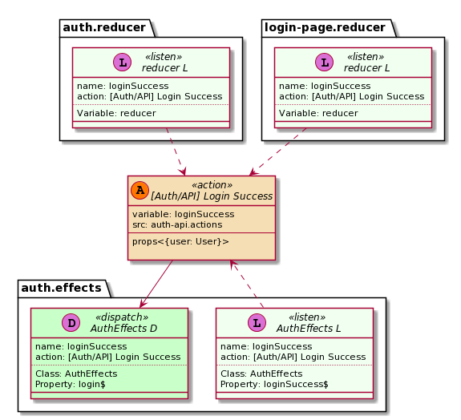

# ngrx-uml
Generate Plant UML diagram from [ngrx/store](https://ngrx.io) project (version > 7.0).

Generate separete diagram for each Action.

Searches for actions created function [createAction](https://ngrx.io/api/store/createAction) and their use.

## Installation

#### Node Package [Node.js](http://nodejs.org/) 

To download and install the ngrx-um run the following command:

```bash
npm install -g ngrx-uml
```

## Commands
Invoke the tool on the command line through the `ngrx-uml` executable. 

The command `ngrx-uml --help` lists the available commands.
`ngrx-uml <command> --help` shows available options for the <command> (such as diagram).

```bash
ng --help
ng diagram --help
```

| Command      | Description                                                                                                                                     |
| ------------ | ----------------------------------------------------------------------------------------------------------------------------------------------- |
| **diagram**    | Generate plantUML diagram                                                                        |
| **diagnostic** | Diagnostic tools                                                                        |


### Diagram Command

#### Usage:

```bash
ngrx-uml diagram -f '**/*ts' -d ../ngrx/projects/example-app/ -i '../**/*.spec.ts' -c tsconfig.app.json
```


| Option | Alias | Description                         | Type | Default |
| --------| ------| ------------------------------------------------------------------- | -------- | ---------- |
|  --version    | |              Show version number                                    | boolean |            |
| --log     | -l |   Log level. [choices: "TRACE", "DEBUG", "INFO", "WARN", "ERROR", "SILENT"] | | "INFO" |
|  --help   | -h |          Show help                                                    |    boolean | |
|  --files | -f  |           Glob-like file pattern specifying the filepath for the source files. Relative to baseDir | string  |  "**/*.ts" |
|  --ignore | -i  |          Glob-like file pattern specifying files to ignore. | array | ["\*\*/*.spec.ts", "\*\*/node_modules/\*\*"] |
|  --imageFormat | --im |    Image format. To turn off image generation set to off [choices: "eps", "latex", "png", "svg", "txt", "off"] | | "png" |
|  --outDir | -o   |         Redirect output structure to the directory      |  string | "out"  |
|  --baseDir | -d  |         Path to project base directory                   |   string | "" |
|  --tsConfig | -c |         tsconfig.json file name with relative path from baseDir | string |  "tsconfig.json |
|  --toJson | --js |         Generate intermediate files to json             | boolean  |  false |
|  --wsd    | |               Generate plant uml file (.wsd)                | boolean  | false |
|  --clickableLinks | --cl | Convert  terminal links to clickable in vs code terminal | boolean | false |


## Examples

Generated from source code [ngrx/store example app](https://github.com/ngrx/platform/tree/master/projects/example-app) 

### Png



### wsd 

```pascal
@startuml [Auth/API] Login Success

set namespaceSeparator ::

interface "[Auth/API] Login Success" << (A,#FF7700) action >> {
        variable: loginSuccess
        src: auth-api.actions
        --
        props<{user: User}>
}

interface "auth.reducer:: reducer L" << (L,orchid) listen >> {
        name: loginSuccess
        action: [Auth/API] Login Success
        src: auth.reducer
        ..
        Variable: reducer
}

"[Auth/API] Login Success" <.down. "auth.reducer:: reducer L"

interface "auth.effects:: AuthEffects D" << (D,orchid) dispatch >> {
        name: loginSuccess
        action: [Auth/API] Login Success
        src: auth.effects
        ..
        Class: AuthEffects
        Property: login$
}

"[Auth/API] Login Success" -down-> "auth.effects:: AuthEffects D"

@enduml
```

[Plantuml file](docs/assets/examples/_Auth-API_Login-Success.wsd)

### JSON 

[Actions JSON](docs/assets/examples/actions.json)

[Actions with references JSON](docs/assets/examples/actions-with-references.json)

[Action's references JSON](docs/assets/examples/actions-references.json)

```JSON
{
    "name": "[Auth] Logout Confirmation Dismiss",
    "kind": 1002,
    "kindText": "Action",
    "variable": "logoutConfirmationDismiss",
    "filePath": "./actions/auth.actions.ts",
    "references": [
      {
        "name": "logoutConfirmationDismiss",
        "kind": 1003,
        "kindText": "ActionReference",
        "documentation": "",
        "isCall": true,
        "filePath": "./effects/auth.effects.ts",
        "fileName": "auth.effects",
        "declarationContext": [
          {
            "kindText": "ClassDeclaration",
            "name": "AuthEffects"
          },
          {
            "kindText": "PropertyDeclaration",
            "name": "logoutConfirmation$"
          }
        ]
      }
    ]
  }
```


## Using from source files


### Installation

```bash
npm install ngrx-uml
```

### Example

```typescript 

import { GeneratorService, PlantUmlService } from 'ngrx-uml';

const createDiagramService = new GeneratorService(
    new PlantUmlService(),
    {
        outDir: 'out',
        imageFormat: 'svg',
        ignorePattern: ['**/*.spec.ts'],
        saveActionsReferencesToJson: true,
        saveActionsToJson: true,
        saveWsd: true,
        logLevel: 'INFO'
    });

const files = '../../test/test_data/**/*.ts';

createDiagramService.generate(files);


```